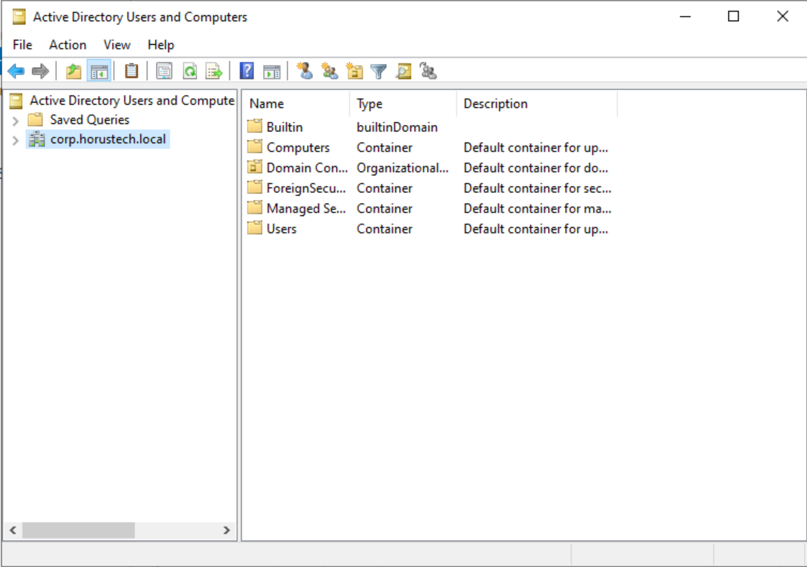
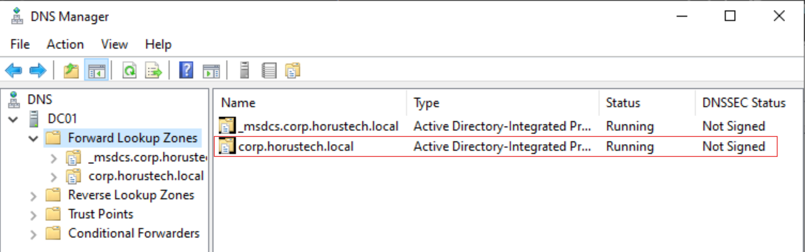
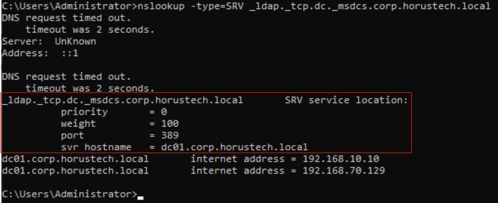
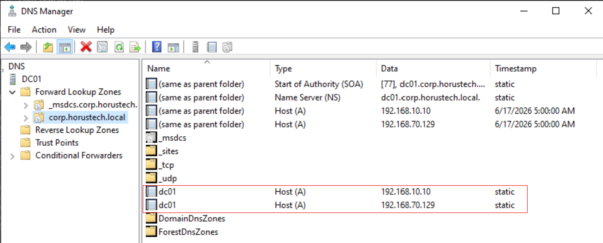
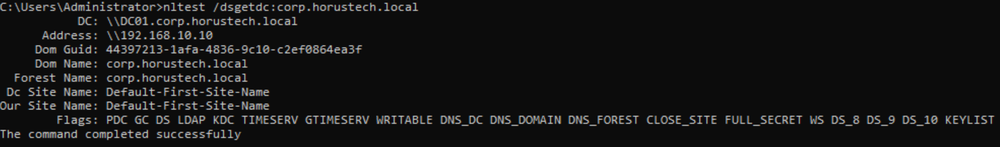
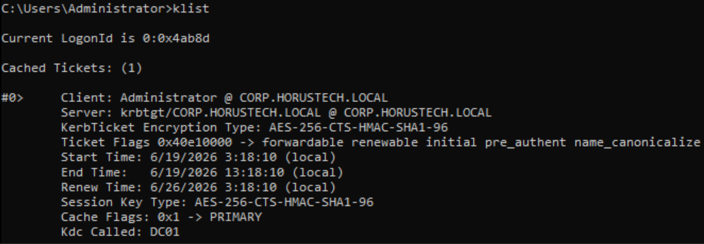

# DC01 Build Log

## Project

Project Horus

## Organization

Horus Technologies

## Phase

Phase 1 – Active Directory Security Modernization

---

# Purpose

This document records the deployment, configuration, validation, and security hardening activities performed during the implementation of the first Domain Controller (DC01).

The purpose is to provide a repeatable deployment record and demonstrate operational execution throughout the project lifecycle.

---

# Server Information

| Item             | Value                        |
| ---------------- | ---------------------------- |
| Hostname         | DC01                         |
| Role             | Domain Controller            |
| Operating System | Windows Server 2022 Standard Evaluation (Desktop Experience) |
| Domain           | corp.horustech.local         |
| IP Address       | 192.168.10.10                |
| Deployment Date  | 2026-06-19                   |

---

# Deployment Timeline

| Step                         | Status      |
| ---------------------------- | ----------- |
| Create VM                    | Completed   |
| Install Windows Server       | Completed   |
| Configure Networking         | Completed   |
| Rename Server                | Completed   |
| Install Updates              | Completed   |
| Install AD DS                | Completed   |
| Install DNS                  | Completed   |
| Promote to Domain Controller | Completed   |
| Validate AD DS               | Completed   |
| Validate DNS                 | Completed   |
| Document Deployment          | Completed   |

---

# Step 1 - Create Virtual Machine

## Objective

Deploy the Windows Server virtual machine that will become DC01.

---

## Configuration

| Setting    | Value |
| ---------- | ----- |
| VM Name    | Horus-DC-01  |
| Generation | VMW Workstation 25H2 or later   |
| CPU        | 2 Cores   |
| RAM        | 4096 MB   |
| Storage    | 80 GB   |
| Network    | VMnet10  |

---

## Screenshot

<p align="center">
  
</p>

<p align="center">
  <em>Figure 1: DC01 virtual machine configuration prior to deployment.</em>
</p>

---

## Validation

* VM created successfully
* VM powers on successfully

Status:

```Completed```

---

# Step 2 - Install Windows Server

## Objective

Install Windows Server 2022 Standard.

---

## Actions Performed

* Mounted Windows Server 2022 installation ISO.
* Booted virtual machine from ISO media.
* Selected Windows Server 2022 Standard Evaluation (Desktop Experience).
* Started operating system installation.
---

## Screenshot

<p align="center">
  
</p>

<p align="center">
  <em>Figure 2: Windows Server 2022 Standard Evaluation (Desktop Experience) installation.</em>
</p>

---

## Validation

* Installation completed successfully
* Administrator account creation screen displayed

Status:

```Completed```

---

# Step 3 - Configure Networking

## Objective

Configure static networking for DC01.

---

## Planned Configuration

| Setting       | Value         |
| ------------- | ------------- |
| IP Address    | 192.168.10.10 |
| Subnet Mask   | 255.255.255.0 |
| Gateway       | N/A (Host-Only) |
| Preferred DNS | 192.168.10.10 |

---

## Screenshot

<p align="center">
  
</p>

<p align="center">
  <em>Figure 3: Static IPv4 configuration assigned to DC01 prior to Active Directory deployment.</em>
</p>

---
## Validation

* Successful ping test
* Internet connectivity verified
* DNS resolution verified

Status:

```Completed```

---

# Step 4 - Rename Server

## Objective

Rename the server according to Project Horus naming standards.

---

## Target Name

```DC01```

---

## Screenshot

<p align="center">
  
</p>

<p align="center">
  <em>Figure 4: Computer name change completed. Restart hasn't been done at this point, therefore name change won't reflect until system restart.</em>
</p>

---
## Validation

* Hostname updated successfully changed from default serveer name to DC01
* Reboot completed successfully
* New hostname verified after login

Status:

```Completed```

---

# Step 5 - Install Updates

## Objective

Apply latest Windows updates prior to domain promotion.

---

## Screenshot

<p align="center">
  
</p>

<p align="center">
  <em>Figure 5: Windows updates prior and after installation.</em>
</p>


---

## Validation

* Windows Update executed successfully
* Latest available updates installed
* Reboot completed successfully
* System reported "You're up to date"

Status:

```Completed```

---

# Step 6 - Install AD DS and DNS

## Objective

Install required Active Directory services.

---

## Roles

* Active Directory Domain Services
* DNS Server

---

## Screenshot

<p align="center">
  
</p>

<p align="center">
  <em>Figure 6: AD DS and DNS Server installation.</em>
</p>

---

## Validation

* AD DS role installed successfully
* DNS Server role installed successfully
* Installation wizard completed without errors
* Server Manager displayed successful installation status

Status:

```Completed```

---

# Step 7 - Promote Server

## Objective

Create the Horus Technologies Active Directory forest.

---

## Forest

```corp.horustech.local```

---

## Screenshot

<p align="center">
  
</p>

<p align="center">
  <em>Figure 7: Figure 11: Server promotion and new forest creation.

</em>
</p>


---

## Validation

* Forest created successfully
* Domain created successfully
* Domain Controller operational

Status:

```Completed```

---

# Step 8 - Post-Deployment Validation

## Active Directory Validation

Checks:

* Active Directory Users and Computers opens successfully
* Domain Controllers OU present
* SYSVOL present
* NETLOGON share present

---

## Screenshot

<p align="center">
  
</p>

<p align="center">
  <em>Figure 8: Active Directory Users and Computers opens successfully. Domain Controlelrs OU present.

</em>
</p>

<p align="center">
  
</p>

<p align="center">
  <em>Figure 9: SYSVOL and NETLOG share present.

</em>
</p>

---

Status:

```Completed```

---

## DNS Validation

Checks:

* Forward Lookup Zone created
* SRV records present
* Host records created

---

## Screenshot

<p align="center">
  
</p>

<p align="center">
  <em>Figure 10: Forward Lookup Zone successfully created.

</em>
</p>

<p align="center">
  
</p>

<p align="center">
  <em>Figure 11: SRV records present.

</em>
</p>

<p align="center">
  
</p>

<p align="center">
  <em>Figure 12: Host records successfully created.

</em>
</p>

---

Status:

```Completed```

---

## Authentication Validation

Checks:

* Domain authentication successful
* Kerberos functioning correctly

---

## Screenshots

<p align="center">
  
</p>

<p align="center">
  <em>Figure 13: Proof of domain authentication.

</em>
</p>

<p align="center">
  
</p>

<p align="center">
  <em>Figure 14: Proof of Kerberos functioning properly.

</em>
</p>

Status:

```Completed```

---

# Issues Encountered

Document deployment issues, troubleshooting steps, and resolutions.

| Issue | Resolution |
| ----- | ---------- |
| DNS delegation warning during domain promotion  | Expected behavior in isolated lab environment. No action required. |
|Domain Controller registered multiple A records (192.168.10.10 and 192.168.70.129)  | Verified as expected due to dual-NIC configuration. Confirmed DNS registration matched active interfaces. |
| nslookup initially displayed DNS timeout messages against IPv6 loopback (::1)  | DNS queries ultimately succeeded. Verified SRV records and DC discovery functionality using nslookup and nltest. |
| nltest /sc_verify returned ERROR_NO_SUCH_DOMAIN on DC01  | Validated domain functionality using nltest /dsgetdc and Kerberos ticket verification. Determined issue was not impacting domain authentication. |
---

# Lessons Learned

Document observations and recommendations for future deployments.

* Configure static networking before promoting a server to a Domain Controller.
* Verify hostname, IP configuration, and Windows updates prior to Active Directory deployment.
* Active Directory promotion automatically creates and registers required DNS zones and SRV records.
* DNS delegation warnings are common in isolated lab environments and do not prevent successful domain promotion.
* Validate DNS functionality using both DNS Manager and command-line tools such as nslookup and nltest.
* Kerberos authentication can be verified through klist and successful issuance of a krbtgt ticket.
* Maintaining detailed screenshots throughout deployment greatly simplifies documentation, troubleshooting, and portfolio creation.
* Post-deployment validation is critical to ensure Active Directory, DNS, and authentication services are functioning correctly before introducing additional workloads.

---

# Deployment Outcome

DC01 was successfully deployed as the first Domain Controller for the
corp.horustech.local Active Directory forest.

The deployment included:

- Windows Server 2022 installation
- Static network configuration
- Hostname standardization
- Windows updates
- Active Directory Domain Services installation
- DNS installation and validation
- Active Directory forest creation
- Domain Controller promotion
- Authentication validation
- Kerberos validation

Post-deployment testing confirmed successful operation of:

- Active Directory
- DNS
- LDAP
- Kerberos
- SYSVOL
- NETLOGON

Status:

```Completed```

---

# Final Snapshot 

```DC01-Post-Deployment-Baseline```

---

# Build Completion Status

```100% Complete```

---

# Reviewer

Project Horus Team

---

# Last Updated

* 2026-06-14
* 2026-06-15
* 2026-06-16
* 2026-06-17
* 2026-06-18
* 2026-06-19
